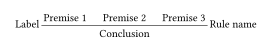
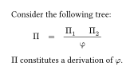
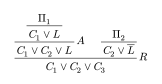
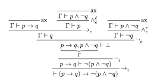

# Curryst

A Typst package for typesetting proof trees.


## Import

You can import the latest version of this package with:

```typst
#import "@preview/curryst:0.6.0": rule, prooftree
```

## Basic usage

To display a proof tree, you first need to create a tree, using the `rule` function. Its first argument is the conclusion, and the other positional arguments are the premises. It also accepts a `name` for the rule name, displayed on the right of the bar, as well as a `label`, displayed on the left of the bar.

```typ
#let tree = rule(
  label: [Label],
  name: [Rule name],
  [Premise 1],
  [Premise 2],
  [Premise 3]
  [Conclusion],
)
```

Then, you can display the tree with the `prooftree` function:

```typ
#prooftree(tree)
```

In this case, we get the following result:



Proof trees can be part of mathematical formulas:

```typ
Consider the following tree:
$
  Pi quad = quad prooftree(
    rule(
      Pi_1,
      Pi_2,
      phi,
    )
  )
$
$Pi$ constitutes a derivation of $phi$.
```



You can specify a rule as the premises of a rule in order to create a tree:

```typ
#prooftree(
  rule(
    name: $R$,
    rule(
      name: $A$,
      rule(
        $Pi_1$,
        $C_1 or L$,
      ),
      $C_1 or C_2 or L$,
    ),
    rule(
      $Pi_2$,
      $C_2 or overline(L)$,
    ),
    $C_1 or C_2 or C_3$,
  )
)
```



As an example, here is a natural deduction proof tree generated with Curryst:



<details>
  <summary>Show code</summary>

  ```typ
  // We import 'rule-set' as well a 'prooftree' and 'rule'
  #import "../curryst.typ": prooftree, rule, rule-set
  #let variable = prooftree(rule(
    name: [Variable],
    $Gamma, x : A tack x : A$,
  ))
  #let abstraction = prooftree(rule(
    name: [Abstraction],
    $Gamma, x: A tack P : B$,
    $Gamma tack lambda x . P : A => B$,
  ))

  #let application = prooftree(rule(
    name: [Application],
    $Gamma tack P : A => B$,
    $Delta tack Q : B$,
    $Gamma, Delta tack P Q : B$,
  ))

  #let weakening = prooftree(rule(
    name: [Weakening],
    $Gamma tack P : B$,
    $Gamma, x : A tack P : B$,
  ))

  #let contraction = prooftree(rule(
    label: [Contraction],
    $Gamma, x : A, y : A tack P : B$,
    $Gamma, z : A tack P[x, y <- z]: B$,
  ))

  #let exchange = prooftree(rule(
    label: [Exchange],
    $Gamma, x : A, y: B, Delta tack P : B$,
    $Gamma, y : B, x: A, Delta tack P : B$,
  ))

  #align(center, rule-set(
    variable,
    abstraction,
    application,
    weakening,
    contraction,
    exchange
  ))
  ```
</details>


This function is not available in the package because they are a lot more ways to typeset multiple rules.

